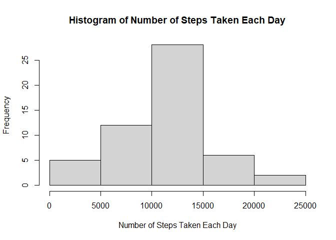
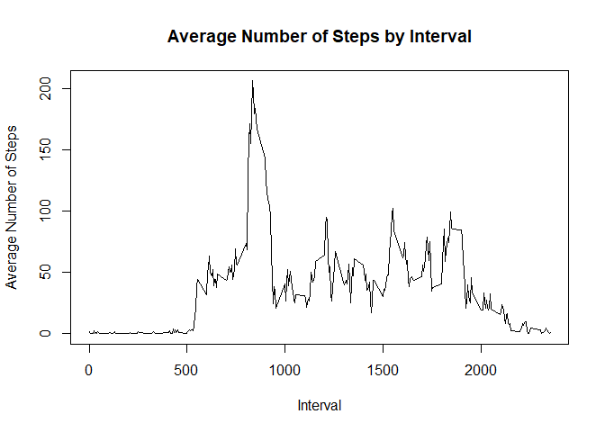
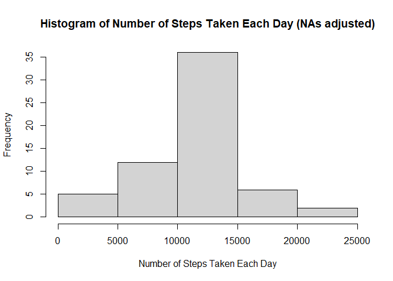
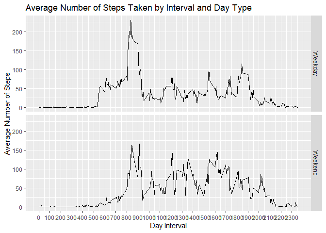

```r
##Load libraries
library(data.table)
library(tidyverse)
```

```
## -- Attaching packages --------------------------------------- tidyverse 1.3.0 --
```

```
## v ggplot2 3.3.3     v purrr   0.3.4
## v tibble  3.0.6     v dplyr   1.0.4
## v tidyr   1.1.2     v stringr 1.4.0
## v readr   1.4.0     v forcats 0.5.1
```

```
## -- Conflicts ------------------------------------------ tidyverse_conflicts() --
## x dplyr::between()   masks data.table::between()
## x dplyr::filter()    masks stats::filter()
## x dplyr::first()     masks data.table::first()
## x dplyr::lag()       masks stats::lag()
## x dplyr::last()      masks data.table::last()
## x purrr::transpose() masks data.table::transpose()
```

```r
##Set options to properly display outputs in text
options(scipen=999)
options(digits=0)
```

## Loading and preprocessing the data

```r
##Loads data and turns to a data.table format.
dat<-read.csv("activity.csv")
dat<-as.data.table(dat)
```


## What is mean total number of steps taken per day?

```r
###What is mean total number of steps taken per day?###
  ##Calculate the total number of steps taken per day
  datTotal<-dat[,lapply(.SD,sum), by=date]
  

  ##Make a histogram of the total number of steps taken each day
  hist(datTotal$steps, xlab="Number of Steps Taken Each Day", main = "Histogram of Number of Steps Taken Each Day")
```

<!-- -->

```r
  ##Calculate and report the mean and median of the total number of steps taken per day
  #Mean
  MeanSteps<-mean(datTotal$steps,na.rm=TRUE)
  MeanSteps
```

```
## [1] 10766
```

```r
  #Median
  MedianSteps<-median(datTotal$steps, na.rm=TRUE)
  MedianSteps
```

```
## [1] 10765
```

The mean total number of steps taken per day is 10766. The median total number of steps taken per day is 10765.

## What is the average daily activity pattern?

```r
###What is the average daily activity pattern?###
  ##Make a time series plot (type = "l") of the 5-minute interval (x-axis) 
  ##and the average number of steps taken, averaged across all days (y-axis)
  datInterval<-dat %>% group_by(interval) %>% summarize(averageSteps=mean(steps,na.rm=TRUE))
  plot(x=datInterval$interval,y=datInterval$averageSteps, type="l", xlab="Interval", ylab="Average Number of Steps", main="Average Number of Steps by Interval")  
```

<!-- -->

```r
  ##Which 5-minute interval, on average across all the days in the dataset, contains the maximum number of steps?
  MaxStepsInterval<-as.numeric(datInterval[which.max(datInterval$averageSteps),"interval"])  
  MaxStepsInterval
```

```
## [1] 835
```
The 5-minute interval that, on average across all days, contains the maximum number of steps is 835.

## Imputing missing values


```r
###Imputing missing values
  ##Calculate and report the total number of missing values in the dataset
  datNAs<-sum(is.na(dat))
  datNAs
```

```
## [1] 2304
```

```r
  ##Devise a strategy for filling in all of the missing values in the dataset
  ##Use the mean instead of NA
  datImpute<-dat%>%left_join(datInterval,by="interval")
  datImpute$steps<-ifelse(is.na(datImpute$steps), datImpute$averageSteps,datImpute$steps)
  ##Create a new dataset that is equal to the original dataset but with the missing data filled in
  datImputeFinal<-datImpute[,1:3]
  head(datImputeFinal)
```

```
##    steps       date interval
## 1:     2 2012-10-01        0
## 2:     0 2012-10-01        5
## 3:     0 2012-10-01       10
## 4:     0 2012-10-01       15
## 5:     0 2012-10-01       20
## 6:     2 2012-10-01       25
```

```r
  ##Make a histogram of the total number of steps taken each day  
  datImputeFinalTotal<-datImputeFinal[,lapply(.SD,sum), by=date]
  hist(datImputeFinalTotal$steps,xlab="Number of Steps Taken Each Day", main = "Histogram of Number of Steps Taken Each Day (NAs adjusted)")
```

<!-- -->

```r
  ##Calculate and report the mean and median total number of steps taken per day.
  #Mean
  MeanImputeSteps<-mean(datImputeFinalTotal$steps)
  MeanImputeSteps
```

```
## [1] 10766
```

```r
  #Median
  MedianImputeSteps<-median(datImputeFinalTotal$steps)
  MedianImputeSteps
```

```
## [1] 10766
```

Median and mean values are relatively the same. There is a difference in the NA adjusted histogram where the frequency of days with 10,000-15,000 increased.

## Are there differences in activity patterns between weekdays and weekends?

```r
###Are there differences in activity patterns between weekdays and weekends?
  ##Create a new factor variable in the dataset with two levels – “weekday” and “weekend” 
  ##indicating whether a given date is a weekday or weekend day.
  datImputeGraph<-datImputeFinal
  datImputeGraph$date<-as.Date(datImputeGraph$date)
  datImputeGraph$"DayType"<-ifelse(weekdays(datImputeGraph$date) %in% c("Saturday","Sunday"), "Weekend", "Weekday")
  datImputeGraph$"DayType"<-as.factor(datImputeGraph$"DayType")
  head(datImputeGraph)
```

```
##    steps       date interval DayType
## 1:     2 2012-10-01        0 Weekday
## 2:     0 2012-10-01        5 Weekday
## 3:     0 2012-10-01       10 Weekday
## 4:     0 2012-10-01       15 Weekday
## 5:     0 2012-10-01       20 Weekday
## 6:     2 2012-10-01       25 Weekday
```

```r
  ##Make a panel plot containing a time series plot of the 5-minute interval (x-axis) 
  ##and the average number of steps taken, averaged across all weekday days or weekend days (y-axis).
  datImputeGraphInterval<-datImputeGraph%>%group_by(interval,DayType)%>%summarize(averageSteps=mean(steps,na.rm=TRUE))
```

```
## `summarise()` has grouped output by 'interval'. You can override using the `.groups` argument.
```

```r
  FinalPlot<- ggplot(data = datImputeGraphInterval, mapping = aes(x = interval, y = averageSteps)) + 
    geom_line() + facet_grid(DayType ~ .) + scale_x_continuous("Day Interval", breaks = seq(min(datImputeGraphInterval$interval), max(datImputeGraphInterval$interval), 100)) + 
    scale_y_continuous("Average Number of Steps") + ggtitle("Average Number of Steps Taken by Interval and Day Type")
  FinalPlot
```

<!-- -->

There does seem to be a difference in the timing interval between weekdays and weekends.
